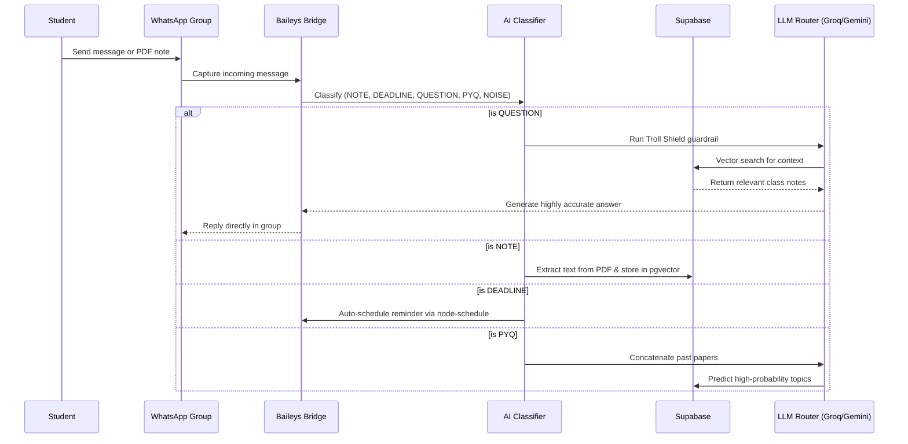
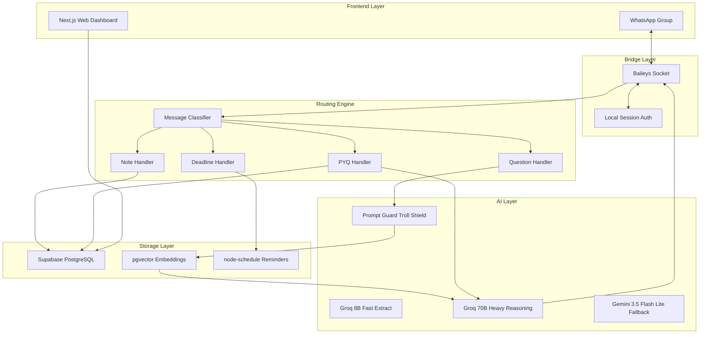

# Class Copilot

> The first AI agent built for your entire class — plug into any WhatsApp group in under 60 seconds.


Students can chat. They can share notes. They can panic about deadlines.

But they cannot organize it all — until now.

Class Copilot is a full-featured AI agent that gives your existing WhatsApp group the ability to autonomously capture notes, track deadlines, predict exam questions, and answer complex queries based on your class material. No new apps to download. No confusing onboarding. Just plug in and study smarter.

**Live Dashboard Demo:** https://classcopilot.vercel.app

## How It Works



## Architecture



## Installation

Class Copilot is lightweight and designed to run locally or on a cheap VPS. It consists of a backend bridge and a Next.js frontend dashboard.

```bash
# 1. Clone the repository
git clone https://github.com/Rishavroy-2006/Class-Copilot.git
cd class-copilot

# 2. Install backend dependencies
npm install

# 3. Setup environment variables
cp .env.example .env

# 4. Install dashboard dependencies
cd dashboard
npm install
```

To run the full stack, you will need two terminal windows:

Terminal 1 (Backend Bridge):
```bash
cd class-copilot
npm start
```

Terminal 2 (Web Dashboard):
```bash
cd class-copilot/dashboard
npm run dev
```

## Environment Variables

| Variable | Required | Default | Description |
|---|---|---|---|
| `GROQ_API_KEY` | Yes | — | For fast classification and heavy reasoning (`llama-3.3-70b-versatile`) |
| `GEMINI_API_KEY` | Yes | — | Triple-redundant fallback for massive contexts (`gemini-3.5-flash-lite`) |
| `SUPABASE_URL` | Yes | — | URL to your Supabase project |
| `SUPABASE_KEY` | Yes | — | `service_role` key to bypass RLS in the backend |
| `NEXT_PUBLIC_SUPABASE_URL` | Yes | — | Supabase URL for the Next.js frontend |
| `NEXT_PUBLIC_SUPABASE_PUBLISHABLE_KEY` | Yes | — | Supabase `anon` key for the frontend dashboard |
| `NEXT_PUBLIC_GROUP_ID` | No | `120363412429875166@g.us` | The specific WhatsApp Chat ID the dashboard should display data for |

## Core Features Reference

### 1. Smart Message Processing & Routing
- **Group-Only Guard**: Operates strictly in group chats (`@g.us`). Ignores DMs to preserve privacy.
- **Hybrid Classifier**: Uses regex rules to classify messages (`NOTE`, `DEADLINE`, `QUESTION`, `PYQ`, `NOISE`). Falls back to Groq (`llama-3.1-8b-instant`) for ambiguous text.
- **Summary Command**: Reply to any long message with "summarize" to generate concise bullet points.

### 2. Note Management & Embeddings
- **PDF & Document Parsing**: Detects attachments and extracts raw text using `pdf-parse`.
- **Spreadsheet Support**: Seamlessly parses Excel spreadsheets (`.xlsx`) and CSVs to extract tabular data (like timetables or marks) using `xlsx`.
- **Subject Extraction**: Automatically predicts the academic subject of a note.
- **Vector Embeddings**: Uses `gemini-embedding-001` to generate 768-dimensional embeddings for semantic search and stores them in Supabase `pgvector`.

### 3. Automated Deadlines & Reminders
- **Date Extraction**: Identifies due dates and descriptions from chat messages.
- **Auto-Scheduling**: Schedules a 24-hour advance reminder via `node-schedule`.

### 4. RAG-Powered Q&A
- **Vector Search**: Uses pgvector `match_notes` RPC to find semantically relevant notes.
- **Contextual Generation**: Injects notes into the LLM prompt with strict anti-hallucination rules.

### 5. PYQ Predictor Engine
- **Pattern Recognition**: Upload past year question papers (PYQs) and the bot will store them by subject.
- **Topic Prediction**: Command the bot to predict an exam, and it will concatenate all past papers for that subject, routing them through the LLM to identify the highest-probability recurring topics.

### 6. Live Web Dashboard
- **Premium UI Redesign**: A gorgeous "Cyber-Glass" aesthetic web interface built with React, Tailwind CSS, and glassmorphism design tokens.
- **Connection Portal**: Features a dedicated onboarding page (`connect.html`) that provides a step-by-step visual guide for linking the bot to WhatsApp, including dynamic QR code handling and a sleek dashboard preview.
- **Native Serving**: The static landing pages are natively integrated to serve on the root path with transparent navbars and responsive layouts, seamlessly routing users to the live class dashboard.

### 7. Cloud-Native Architecture (Render Ready)
- **Database-Backed Auth**: WhatsApp session credentials (`baileys_auth_state`) are securely saved to Supabase instead of the local filesystem. This ensures that the bot stays logged in even when cloud hosts (like Render or Heroku) restart the server.
- **Health Checks & Graceful Shutdown**: Exposes a `/health` HTTP endpoint for uptime monitors and cleanly closes the WhatsApp socket on `SIGTERM`.

## Live Demo & Deployment

**Render Deployment:** The site is configured to run smoothly on [Render](https://render.com). You can spin up the Node.js backend web service and the Next.js frontend to instantly have a persistent, cloud-hosted agent.

### Connecting & Testing Locally

1. Start the bridge using `npm start`.
2. A QR code will appear in your terminal. Open WhatsApp on your primary phone, go to **Settings -> Linked Devices -> Link a Device**, and scan the QR code.
3. The bot's WhatsApp account is now linked!
4. Create a new WhatsApp Group (or use an existing one) and add the bot's phone number to the group.
5. Send this exact message in your test group to see it work:
   > "Does anyone have the syllabus for CS101?"

What to expect:
1. The Baileys bridge intercepts the message.
2. The Classifier instantly identifies it as a `QUESTION`.
3. The Troll Shield verifies it is not a jailbreak attempt.
4. The system queries Supabase for any notes tagged `CS101 Syllabus`.
5. The LLM Router synthesizes an answer and replies directly in the chat within seconds.

## Security & Disclaimers

- **Group-Only Privacy** — The bot physically cannot read Direct Messages or Broadcasts. The global guardrail drops all non-group traffic at the socket level.
- **Troll Shield** — A dedicated 86M guardrail model intercepts all queries before they hit the expensive LLM.
- **Local Auth** — WhatsApp session tokens are stored locally in the `/auth` folder. They never touch the cloud.
- **Row Level Security (RLS)** — The Next.js dashboard uses a public `anon` key, safely locked down by Supabase RLS policies to ensure it can only `SELECT` data, preventing malicious client-side edits.
- **Backend-Only Admin** — The backend connects to Supabase exclusively via the secure `service_role` key to insert and update data securely.
- **Hackathon Disclosure:** This project uses an unofficial library (Baileys) to connect to WhatsApp rather than Meta's official Business API. Treat this as a demo-scale bridge.
- **Git Security:** All API keys are strictly stored in `.env` and `.env.local` templates, which are strictly protected by `.gitignore`.

## Comparison Table

| Metric | Class Copilot | NotebookLM / Single-Player Tools | Traditional LMS (Canvas/Blackboard) |
|---|---|---|---|
| **Adoption Friction** | Zero (It is just WhatsApp) | High (Requires downloading or learning an app) | High (Clunky, requires separate login) |
| **Multiplayer** | Native — entire class shares one brain | No — built for solo study | Yes, but heavily siloed by professors |
| **Deadlines** | Pings you right where you chat | Manual entry required | Buried in a syllabus PDF |
| **Cost** | Virtually free (Groq/Gemini free tiers) | Paid tiers for heavy usage | Institution pays thousands |

## Roadmap

**Now**
- WhatsApp listener via Baileys
- Global Group-Only Privacy Guard
- Smart Regex + LLM message classifier
- RAG Q&A using Supabase pgvector
- Auto-deadline scheduling
- PYQ Predictor via concatenated RAG
- Next.js Web Dashboard for out-of-chat viewing
- Native Landing Page integration with Cyber-Glass UI Redesign
- Render Cloud Deployment Compatibility

**Next**
- **Voice Note Transcription:** Whisper API integration so the bot can summarize voice rambles.
- **Authentication:** Allowing individual students to log into the dashboard securely.

**Future**
- **Handwritten Notes:** Vision integration to read messy whiteboard photos.
- **Multi-Subject Routing:** Smarter partitioning for mega-groups covering multiple classes.

## Tech Stack & License

- **Language:** JavaScript (Node.js 18+), TypeScript (React/Next.js)
- **Bridge:** `@whiskeysockets/baileys`
- **Database:** Supabase (PostgreSQL + pgvector)
- **Primary LLM:** Groq (`llama-3.3-70b`, `llama-3.1-8b`, `prompt-guard`)
- **Fallback LLM:** Google Gemini (`gemini-3.5-flash-lite`)

This project is open-sourced under the MIT License — see [LICENSE](./LICENSE).
