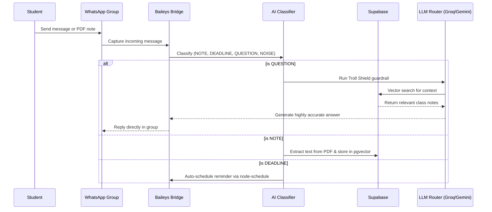
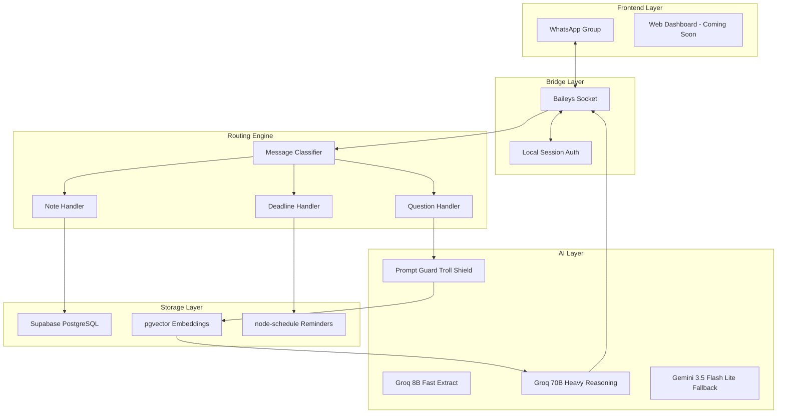

# Class Copilot

> The first AI agent built for your entire class — plug into any WhatsApp group in under 60 seconds.


---

Students can chat. They can share notes. They can panic about deadlines.

But they cannot organize it all — until now.

Class Copilot is a full-featured AI agent that gives your existing WhatsApp group the ability to autonomously capture notes, track deadlines, and answer complex questions based on your class material. No new apps to download. No confusing dashboards. No friction unless you want it.

**demo:** https://youtu.be/your-demo-link-here

---

## How It Works



---

## Architecture



---

## Installation

### Developers — Standard Config

Class Copilot is lightweight and designed to run entirely locally or on a cheap VPS. 

```bash
git clone <your-repo-url>
cd class-copilot
npm install
```

Copy the `.env.example` file to set up your environment:

```bash
cp .env.example .env
```

---

## Environment Variables

| Variable | Required | Default | Description |
|---|---|---|---|
| `GROQ_API_KEY` | Yes | — | For fast classification and heavy reasoning (`llama-3.3-70b-versatile`) |
| `GEMINI_API_KEY` | Yes | — | Triple-redundant fallback for massive contexts (`gemini-3.5-flash-lite`) |
| `SUPABASE_URL` | Yes | — | URL to your Supabase project |
| `SUPABASE_KEY` | Yes | — | `service_role` key to bypass RLS in the backend |

---

## Core Features Reference

### Message Processing

| Handler | Description |
|---|---|
| `classifyMessage` | Hybrid Regex + 8B LLM router that sorts noise from signal instantly |
| `handleNote` | Detects PDFs, extracts raw text via `pdf-parse`, and stores vectors |
| `handleDeadline` | Parses dates from chat and auto-schedules reminders |

### Security & Inference

| Handler | Description |
|---|---|
| `Troll Shield` | Native `llama-prompt-guard-2-86m` firewall to block jailbreaks |
| `llmRouter` | Auto-failover logic ensuring 99.9% uptime across Groq and Gemini |

---

## Live Demo (How to Test)

1. Start the bridge: `npm start`
2. Scan the QR code that appears in your terminal with your phone (**WhatsApp → Settings → Linked Devices**).
3. Send this in your test group:

> "Does anyone have the syllabus for CS101?"

What happens:

1. The Baileys bridge intercepts the message.
2. The Classifier instantly identifies it as a `QUESTION`.
3. The Troll Shield verifies it is not a jailbreak attempt.
4. The system queries Supabase for any notes tagged `CS101 Syllabus`.
5. The LLM Router synthesizes an answer and replies directly in the chat within seconds.

---

## Security

- **Troll Shield** — A dedicated 86M guardrail model intercepts all queries before they hit the expensive LLM.
- **Local Auth** — WhatsApp session tokens are stored locally in the `/auth` folder. They never touch the cloud.
- **Backend-Only Secrets** — Built as a strict Node.js backend. No React/Next.js frontend exposure (`NEXT_PUBLIC_`) vulnerabilities.
- **No Database Exposure** — Connects to Supabase exclusively via the secure `service_role` key.

---

## Why Class Copilot?

| | Class Copilot | NotebookLM / Single-Player Tools | Traditional LMS (Canvas/Blackboard) |
|---|---|---|---|
| **Adoption Friction** | Zero (It's just WhatsApp) | High (Requires downloading/learning an app) | High (Clunky, requires separate login) |
| **Multiplayer** | Native — entire class shares one brain | No — built for solo study | Yes, but heavily siloed by professors |
| **Deadlines** | Pings you right where you chat | Manual entry required | Buried in a syllabus PDF |
| **Cost** | Virtually free (Groq/Gemini free tiers) | Paid tiers for heavy usage | Institution pays thousands |

---

## Roadmap

**Now — The MVP**
- WhatsApp listener via Baileys
- Smart Regex + LLM message classifier
- RAG Q&A using Supabase pgvector
- Auto-deadline scheduling 
- Troll Shield guardrails

**Next — Visual & Audio Expansion**
- **PYQ Predictor:** Upload past papers and let the AI map out high-probability exam topics.
- **Voice Note Transcription:** Whisper API integration so the bot can summarize 4-minute voice rambles.
- **Web Dashboard:** A clean Next.js frontend to view all merged notes outside of WhatsApp.

**Future — OCR & Multi-modal**
- **Handwritten Notes:** Tesseract.js/Vision integration to read messy whiteboard photos.
- **Multi-Subject Routing:** Smarter partitioning for mega-groups covering multiple classes.

---

## Tech Stack

- **Language:** JavaScript (Node.js 18+)
- **Bridge:** `@whiskeysockets/baileys`
- **Database:** Supabase (PostgreSQL + pgvector)
- **Primary LLM:** Groq (`llama-3.3-70b`, `llama-3.1-8b`, `prompt-guard`)
- **Fallback LLM:** Google Gemini (`gemini-3.5-flash-lite`)

---

## A Quick Heads Up

**Hackathon Disclosure:** This project uses an unofficial library (Baileys) to connect to WhatsApp rather than Meta's official Business API (which requires business verification and limits group functionality). Treat this as a demo-scale bridge. 

**Git Security:** Ensure all API keys are strictly stored in `.env`. If you accidentally hardcode a key and commit it, you must revoke and regenerate it immediately, as it stays in your Git history forever.

---

## License

MIT — see [LICENSE](./LICENSE)
